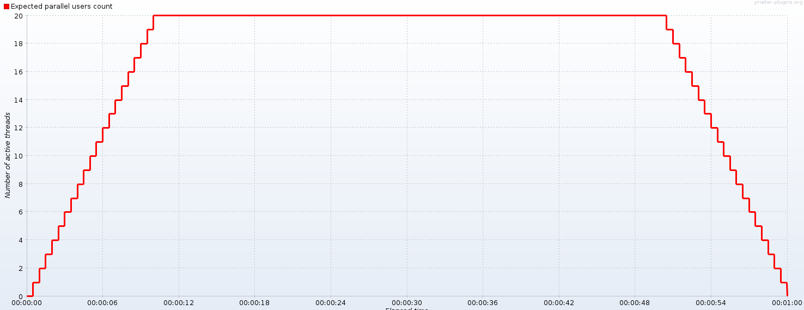
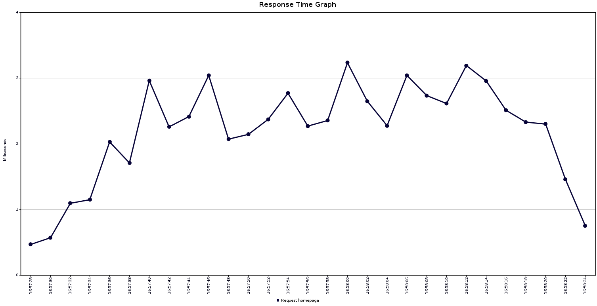

# Load test with JMeter
## Description
The test contained in the `loadtest.jmx` file does the following actions:
- Create 100 threads that represent user access to the homepage `"/"`.
- Start and stop those threads progressively during 10s and hold them for 40s as shown in the previsionnal graph bellow.
- Each thread sends an HTTP request every 0.5s until it shuts down.

More specifically, the following JMeter component architecture has been implemented:
- Ultimate thread group (displays the graph above)
    - Loop Controller (sets the number of iterations)
    - HTTP Request Sampler
        - Constant Timer 500ms (applies short delay between requests)
    - Result Table (list of samples)
    - Response Time Graph (outputs the graph bellow)
    - Summary Report (gives statistic data like average, min, max, etc.)

## Results
The following graph shows the response time in milliseconds from the server. We can see that the test went as expected: the second graphs follows the shape of the first one, which means that the latency has increased the more load there was. During the first 15s, the response time increases. From 16s to 50s the values vary between 2 and 3 miliseconds. Finally, within the last 15s, the values slowly decrease until there's no more active thread.

The results show us that our server never took more than ~3.3ms to give a response to the clients which is a very acceptable time.